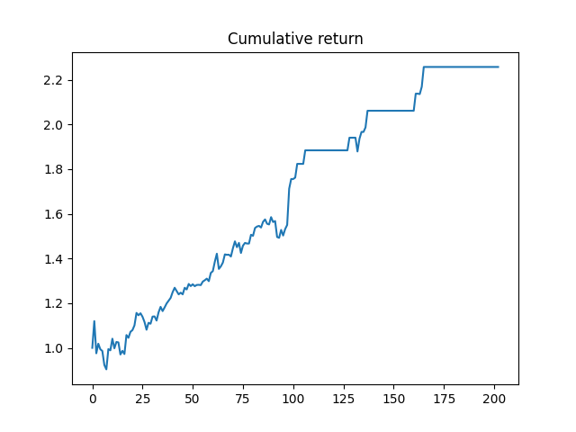

# Assignment3

# Introduction

This assignment refer to a paper, 'Forecast of LSTM-XGBoost in Stock Price Based on Optimization', published by Intelligent Automation & Soft Computing. 
You can access to the paper through https://www.techscience.com/iasc/v29n3/43035/pdf. 

The main proposal is to predict the up or down direction of stock price in the next day, with XGBoost. 
Two special ideas of this paper, one is to use Bayesian Optimization to search the optimal parameters of XGBoost model.
Another is to use LSTM as a pre-training model, the prediction price features of the next day is applied to be the input for XGBoost model.
All research result is based on the data of APPLE from 2017.01.01 to 2020.12.31, you can adjust parameters according to different stocks.

# Environment

Pycharm (Professional Edition) Python 3.7

# Requirements 

numpy 

pandas 

pickle

keras

xgboost

BayesianOptimization

As this strategy utilize the xgboost package, it's highly recommended conduct in Windows or Mac installed brew.

# Model Elaboration

The original feature data is High, Low, Open, Close, Adj Close.
As there are totally 1000+ data, 80% is set to be the train set.
We have a target date, t.

First, we should train the LSTM model to obtain the prediction value of five feature data for the target day.
Here is a parameter pre_length, which is the length of previous data we used to predict the price in target date.
I have experienced several values for that, and pre_length=3 is a good choice.
LSTM model is trained with t-1, t-2, t-3 price data, and each feature is trained separately to find its own principle.
So, the input data is an array (800, 3, 1).

Second, we should train the XGBoost Classifier model with the original data to find which features of price data means an up or down.
Now, the five features is trained together, so the input size is (800, 5).
In this process, we use Bayesian Optimization to search the optimal parameters of XGBoost model, which is more computed efficiently and more concise in code.

Third, using the prediction value (800, 5) from LSTM as the input for trained XGBoost Classifier model, with the best parameters chosen by Bayesian Optimization, to classify the trend from t to t+1. 

# Back-test Result

The back_test period is from 2020.03.12 to 2020.12.31. 
The annualized return is about 274%, the maximum drawdown is 19.28%.

# Conclusion

If there are no device constraints, more data should be used to train and test the model. 

Bayesian Optimization is a good automation method to select parameters.

